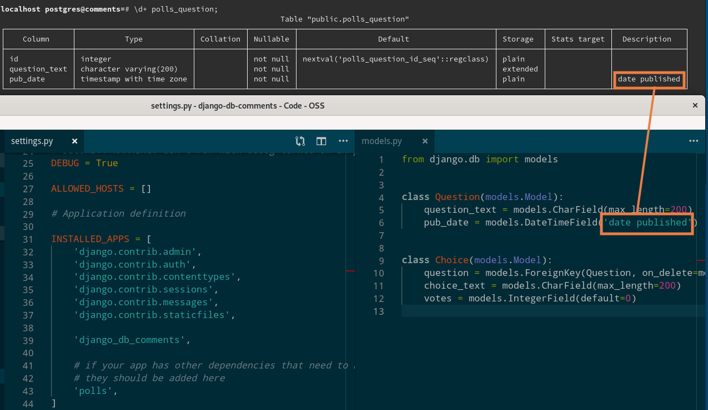

=============================
Django Db Comments
=============================

.. image:: https://badge.fury.io/py/django-db-comments.svg
    :target: https://badge.fury.io/py/django-db-comments

.. image:: https://travis-ci.org/vanadium23/django-db-comments.svg?branch=master
    :target: https://travis-ci.org/vanadium23/django-db-comments

.. image:: https://codecov.io/gh/vanadium23/django-db-comments/branch/master/graph/badge.svg
    :target: https://codecov.io/gh/vanadium23/django-db-comments

Move your model's verbose name and help_text to database comments:

Documentation
-------------

The full documentation is at https://django-db-comments.readthedocs.io.

Quickstart
----------

Install Django Db Comments::

    pip install django-db-comments

Add it to your `INSTALLED_APPS`:

.. code-block:: python

    INSTALLED_APPS = (
        ...
        'django_db_comments',
        ...
    )

Features
--------

* Copy verbose_name and help_text to columns in DB, currently: Postgres_.

Running Tests
-------------

Does the code actually work?

::

    source <YOURVIRTUALENV>/bin/activate
    (myenv) $ pip install tox
    (myenv) $ tox

Credits
-------

Tools used in rendering this package:

*  Cookiecutter_
*  `cookiecutter-djangopackage`_

.. _Cookiecutter: https://github.com/audreyr/cookiecutter
.. _`cookiecutter-djangopackage`: https://github.com/pydanny/cookiecutter-djangopackage
.. _Postgres: https://www.postgresql.org/docs/9.1/sql-comment.html
